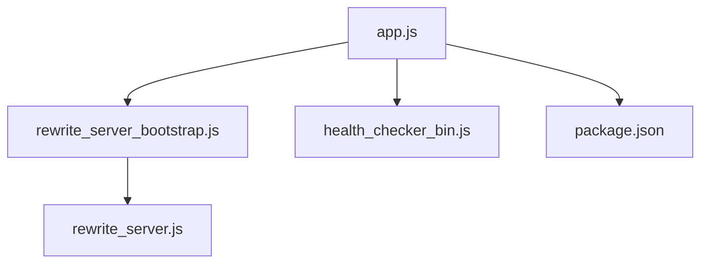

# Custom GTM Project

This project provides a custom implementation for Google Tag Manager (GTM) extraction and rewrite server functionality. It is designed to run on Node.js and includes health checking, server bootstrapping, and request rewriting features.

## Project Structure

```
custom-gtm/
├── app.js
├── health_checker_bin.js
├── package.json
├── rewrite_server_bootstrap.js
├── rewrite_server.js
└── README.md
```

## File Descriptions

- **app.js**: Main entry point for the application. Initializes and starts the server.
- **health_checker_bin.js**: Provides health check functionality for the server.
- **package.json**: Contains project metadata, dependencies, and scripts.
- **rewrite_server_bootstrap.js**: Bootstraps the rewrite server, handling initial setup and configuration.
- **rewrite_server.js**: Implements the core logic for request rewriting and server operations.

## Mermaid Diagram



## Getting Started

1. Install dependencies:
   ```sh
   npm install
   ```
2. Start the application:
   ```sh
   node app.js
   ```

## License

MIT
